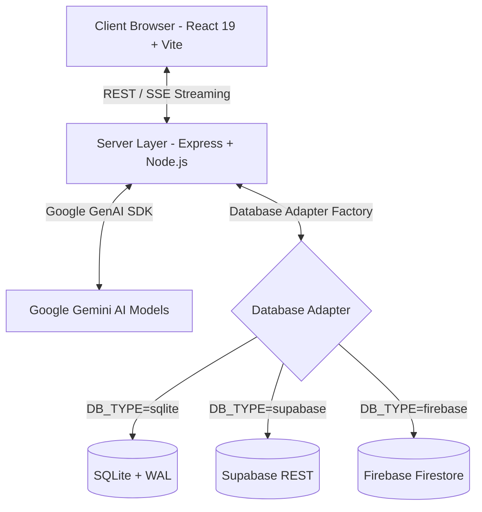

# 📘 VibeFlow — Documentação Master do Projeto (12 Etapas)

Bem-vindo à documentação oficial do **VibeFlow**, uma plataforma completa de CRM, orquestração e governança de **Agentes de Inteligência Artificial Autônomos com Supervisão Humana (*Human-in-the-Loop*)**.

Esta documentação condensa todas as 12 etapas de engenharia, design, segurança, infraestrutura e estratégia comercial do produto, desenhado especificamente para comercialização no modelo **White Label**.

---

## 📑 Sumário

1. [Visão Geral & Conceito do Produto](#1-visão-geral--conceito-do-produto)
2. [Etapa 1: Planejamento & Arquitetura](#etapa-1-planejamento--arquitetura)
3. [Etapa 2: Branding & Sistema de Design](#etapa-2-branding--sistema-de-design)
4. [Etapa 3: Landing Page Go-To-Market](#etapa-3-landing-page-go-to-market)
5. [Etapa 4: Desenvolvimento Frontend](#etapa-4-desenvolvimento-frontend)
6. [Etapa 5: Backend & Multi-Database (SQLite / Supabase / Firebase)](#etapa-5-backend--multi-database)
7. [Etapa 6: Segurança, Governança & Compliance](#etapa-6-segurança-governança--compliance)
8. [Etapa 7: Performance, Streaming & Latência](#etapa-7-performance-streaming--latência)
9. [Etapa 8: Debugger, Observabilidade & Thinking Mode](#etapa-8-debugger-observabilidade--thinking-mode)
10. [Etapa 9: Testes & Garantia de Qualidade (QA)](#etapa-9-testes--garantia-de-qualidade-qa)
11. [Etapa 10: SEO Técnico & Core Web Vitals](#etapa-10-seo-técnico--core-web-vitals)
12. [Etapa 11: Venda, Modelo White Label & Licenciamento](#etapa-11-venda-modelo-white-label--licenciamento)
13. [Etapa 12: Marketing, ICP & Estratégia GTM](#etapa-12-marketing-icp--estratégia-gtm)
14. [Guia de Comunicação com Clientes (Pitch Ready)](#guia-de-comunicação-com-clientes-pitch-ready)
15. [Guia Prático: O que Fazer para Entregar o Produto ao seu Comprador](#15-guia-prático-o-que-fazer-para-entregar-o-produto-ao-seu-comprador)

---

## 1. Visão Geral & Conceito do Produto

O **VibeFlow** resolve o maior desafio da adoção corporativa de Inteligência Artificial: **a falta de controle e previsibilidade das ações autônomas**. 

Enquanto chatbots tradicionais apenas respondem perguntas, o VibeFlow entrega uma **força de trabalho de agentes de IA** especializados (Vendas, Suporte, Análise de Dados, SEO, Gestão) que operam tarefas operacionais e submetem ações de médio/alto risco à aprovação prévia de um gerente humano.

---

## Etapa 1: Planejamento & Arquitetura

O planejamento do app baseia-se em uma arquitetura limpa e desacoplada em 3 camadas principais:



- **Modularidade de Infraestrutura:** Mudança de banco via variável de ambiente `DB_TYPE`.
- **Separação Server/Client:** Chaves sensíveis de API permanecem estritamente isoladas no servidor.

---

## Etapa 2: Branding & Sistema de Design

- **Estética Neumórfica & Dark Mode:** Desenvolvida em tons profundos (`#0F172A`), primários de violeta neon (`#8B5CF6`) e azul ciano (`#06B6D4`).
- **Fontes Google:** `Inter` (para textos legíveis e dados) e `Outfit` (para títulos de alto impacto).
- **Personalização White Label:** Permite a customização dinâmica da marca, logo, paleta de cores e nome da plataforma através do painel `/branding` e do componente `BrandingContext.tsx`.

---

## Etapa 3: Landing Page Go-To-Market

A página inicial pública (`src/pages/Landing.tsx`) foi construída com foco em **conversão imediata**:

- **Hero Section Dinâmica:** Demonstração visual dos agentes atuando em tempo real.
- **Tabela Comparativa:** Demonstra a economia financeira entre contratar funcionários tradicionais vs. operar Agentes VibeFlow.
- **Grade de Planos SaaS:** Planos Starter, Pro e Enterprise prontos para precificação.
- **Prova Social & FAQ:** Sessões estruturadas com perguntas frequentes e depoimentos.

---

## Etapa 4: Desenvolvimento Frontend

Construído com **React 19 + TypeScript + Vite + TailwindCSS + Motion + Lucide Icons**, o frontend inclui 13 páginas completas:

1. `/` — Landing Page Pública de Vendas.
2. `/dashboard` — Visão geral de métricas, agentes ativos e atalhos rápidos.
3. `/agents` — Gerenciamento e criação de Agentes Virtuais.
4. `/command-center` — Chat interativo com streaming e seleção de modelos.
5. `/approvals` — Fila de aprovações de risco (*Human-in-the-Loop*).
6. `/audit-logs` — Histórico detalhado e imutável de eventos.
7. `/mcp-gateway` — Gateway de integração com servidores MCP (Model Context Protocol).
8. `/branding` — Configuração de marca e identidade do cliente.
9. `/checkout` — Fluxo de assinatura de planos.
10. `/admin` — Gestão de usuários e permissões do sistema.
11. `/login` / `/forgot-password` — Autenticação de usuários.
12. `/settings` — Configurações de conta e API Keys.

---

## Etapa 5: Backend & Multi-Database

O backend Node.js utilza o padrão **Factory Pattern** (`server/db/index.ts`) para suportar 3 opções de banco de dados sem alterar o código da aplicação:

1. **SQLite (`server/db/adapters/sqlite.ts`):** Banco local em arquivo com suporte a modo WAL (*Write-Ahead Logging*). Acompanha banco preenchido com dados de demonstração.
2. **Supabase (`server/db/adapters/supabase.ts`):** Integração REST nativa via Supabase API (`SUPABASE_URL` e `SUPABASE_SERVICE_KEY`).
3. **Firebase (`server/db/adapters/firebase.ts`):** Integração Cloud Firestore nativa (`FIREBASE_PROJECT_ID`).

---

## Etapa 6: Segurança, Governança & Compliance

- **Criptografia de Senhas:** Derivação de chaves via **PBKDF2 com Salt aleatório de 16 bytes e HMAC-SHA512** (1000 iterações).
- **Proteção contra Vulnerabilidades:** Headers HTTP gerenciados via **Helmet**, proteção contra CORS não autorizado e limite de requisições via **express-rate-limit**.
- **Human-in-the-Loop (Governança):** Fila de aprovação para ações categorizadas por níveis de risco (*low, medium, high, critical*).
- **Audit Logs:** Registro imutável de auditoria com autor, ação, status e timestamp para conformidade com a **LGPD / GDPR**.

---

## Etapa 7: Performance, Streaming & Latência

- **Content Streaming (SSE):** Respostas de IA transmitidas em tempo real token-a-token utilizando `gemini-3-flash-preview`.
- **Concorrência do Banco:** SQLite em modo WAL permite múltiplas leituras em paralelo sem travar a escrita.
- **Lazy Loading de Adapters:** Conexões cloud (Supabase/Firebase) alocam memória sob demanda, garantindo footprint leve (<100MB RAM no Node.js).

---

## Etapa 8: Debugger, Observabilidade & Thinking Mode

- **Logger Estruturado:** Módulo `server/lib/logger.ts` utilizando **Pino** para log de eventos por severidade (`INFO`, `WARN`, `ERROR`, `FATAL`).
- **Inspection de Raciocínio (Thinking Mode):** Visualização transparente dos passos mentais (*thoughts*) executados pelo modelo Gemini Pro antes da resposta final.
- **Métricas Visuais:** Painel com medidores de latência média, taxa de sucesso de requisições e consumo de memória dos agentes.

---

## Etapa 9: Testes & Garantia de Qualidade (QA)

- **Suíte Vitest:** Arquivos `tests/db.test.ts` e `tests/auth.test.ts` para testes unitários e de integração.
- **Verificação de Tipagem Estrita:** Projeto validado via `npx tsc --noEmit` sem erros de compilação.
- **Comandos de QA:**
  ```bash
  npm run test:run  # Executa suíte de testes
  npm run lint      # Verifica tipagem do TypeScript
  ```

---

## Etapa 10: SEO Técnico & Core Web Vitals

- **Meta Tags Completas:** Indexação pronta em `index.html` com títulos dinâmicos, descrições e canonical URL.
- **Open Graph & Twitter Cards:** Previews em WhatsApp, LinkedIn e redes sociais.
- **Schema.org (JSON-LD):** Marcação estruturada para motores de busca reconhecerem a aplicação como `SoftwareApplication`.
- **Core Web Vitals:** Google Fonts pré-conectadas (Inter + Outfit) e pacotes otimizados para rápida renderização de LCP e INP.

---

## Etapa 11: Venda, Modelo White Label & Licenciamento

- **100% Livre de Royalties:** O comprador possui os direitos comerciais para vender o software para quantos clientes desejar.
- **Script de Onboarding Interativo:** Executado via `npm run setup` para criar `.env.local` e banco SQLite inicial.
- **Documentação de Implantação:** Guia completo no arquivo [`SETUP.md`](file:///home/alinedeolivgs/Documentos/🛒Apps%20Marketplace/🛠️crm-Vibeflow/SETUP.md).

---

## Etapa 12: Marketing, ICP & Estratégia GTM

- **Posicionamento de Mercado:** Central de Comando de IA para Agências, E-commerces e Empresas B2B.
- **Dados de Demonstração (Demo Seed):** Acompanha 6 agentes treinados com históricos e aprovações prontas para apresentações comerciais imediatas.
- **Manual de Vendas:** Estratégia detalhada no arquivo [`MARKETING.md`](file:///home/alinedeolivgs/Documentos/🛒Apps%20Marketplace/🛠️crm-Vibeflow/MARKETING.md).

---

## 💬 Guia de Comunicação com Clientes (Pitch Ready)

Utilize estes modelos prontos para responder perguntas de potenciais compradores do seu portfólio:

### 🔒 Resposta sobre Segurança
> *"A arquitetura do VibeFlow segue o padrão Zero Trust: senhas são criptografadas via PBKDF2 com Salt SHA-512, chaves de API nunca são expostas ao navegador do usuário e todas as decisões da IA passam por uma Fila de Aprovação Humana para ações de risco, acompanhadas por Audit Logs em conformidade com a LGPD."*

### ⚡ Resposta sobre Performance
> *"O VibeFlow utiliza streaming progressivo de IA via Gemini Flash, oferecendo respostas em milissegundos. O banco de dados SQLite opera em modo WAL para leituras concorrentes ultrarrápidas, e a aplicação pode rodar com alto desempenho em servidores a partir de $5/mês."*

### 🛠️ Resposta sobre Debugger & Observabilidade
> *"O sistema possui logs centralizados via Pino e conta com a tecnologia Thinking Mode no Gemini Pro, permitindo que a sua equipe inspecione o raciocínio da IA passo a passo antes que qualquer resposta ou ação seja executada."*

### 🧪 Resposta sobre Testes & QA
> *"O código é 100% tipado com TypeScript em modo estrito (zero erros no compilador) e inclui suíte automatizada de testes com Vitest cobrindo autenticação, sessão e os adaptadores de banco de dados."*

### 🔍 Resposta sobre SEO
> *"A aplicação já vem com HTML5 semântico, metadados Open Graph para cards no WhatsApp e LinkedIn, Schema.org JSON-LD para o Google e otimização para Core Web Vitals (LCP/INP)."*

### 💰 Resposta sobre Venda White Label
> *"Você adquire o código-fonte 100% liberado, sem pagamentos de royalties ou mensalidades. É possível trocar entre SQLite, Supabase e Firebase alterando apenas 1 linha de configuração e personalizar toda a marca para revendê-la sob o seu domínio."*

---

## 15. Guia Prático: O que Fazer para Entregar o Produto ao seu Comprador

Para realizar uma entrega perfeita (*handover*) do VibeFlow após realizar uma venda no seu portfólio, siga o passo a passo abaixo:

### 1. Preparação dos Arquivos para Envio
1. Exclua a pasta `node_modules` e o banco local em `data/vibeflow.db` para enviar um pacote limpo.
2. Compacte a pasta do projeto em formato `.zip` ou envie o convite de acesso ao repositório Git privado.

### 2. Instruções de Inicialização para o Comprador
Oriente o seu comprador a executar os seguintes comandos no terminal da máquina dele:

```bash
# 1. Instalar dependências e preparar ambiente automaticamente
npm run setup

# 2. Iniciar o servidor e a interface visual simultaneamente
npm run dev:all
```

### 3. Credenciais Padrão de Acesso Inicial
Informe ao comprador as credenciais para o primeiro acesso administrativo:
- **URL da Aplicação:** `http://localhost:3000`
- **Email:** `admin@vibeflow.ai`
- **Senha:** `admin123`

### 4. Checklist de Configuração Personalizada pós-Entrega
Instrua o comprador a realizar 3 simples passos de configuração inicial:
1. **Adicionar a Chave da API Gemini:** Inserir a chave no arquivo `.env.local` na linha `GEMINI_API_KEY=""`.
2. **Escolher o Banco de Dados:** Manter `DB_TYPE="sqlite"` para testes imediatos ou preencher com as credenciais do **Supabase** / **Firebase**.
3. **Personalizar a Marca (White Label):** Acessar a página `/branding` dentro do aplicativo para alterar o nome, logo e paleta de cores da plataforma.
