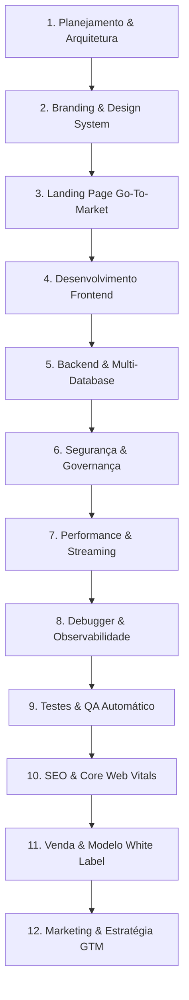

# 🚀 VibeFlow — Guia Consolidado das 12 Etapas do Projeto

Este documento condensa a metodologia completa de engenharia, arquitetura e inteligência comercial aplicada no código do **VibeFlow**.

---

## 🗺️ As 12 Etapas de Desenvolvimento



---

### 1. Planejamento de Criação do App
- **Conceito:** Central de comando de agentes autônomos com supervisão humana integrada (*Human-in-the-Loop*).
- **Arquitetura:** Frontend desacoplado (React + Vite) + Backend Node.js/Express + Padrão Adapter para bancos relacionais e NoSQL cloud.

### 2. Branding & Sistema de Design
- **Paleta de Cores:** HSLTailored dark mode com tons neon primários (`#8B5CF6`), accents neon (`#06B6D4`) e fundos profundos (`#0F172A`).
- **White Label Customizável:** Suporte a troca dinâmica de logo, nome do SaaS, fontes Google Fonts (Inter + Outfit) e temas via `BrandingContext.tsx`.

### 3. Landing Page de Alta Conversão
- **Localização:** `src/pages/Landing.tsx`.
- **Elementos:** Hero dinâmico com visualização de agentes, calculadora de economia de tempo, tabela comparativa de planos, depoimentos e CTAs estratégicos.

### 4. Desenvolvimento Frontend
- **Stack:** React 19 + TypeScript + Vite + TailwindCSS + Motion + Lucide React.
- **Telas Prontas:** Landing Page, Dashboard, Agent Hub, Command Center, Fila de Aprovações, Audit Logs, MCP Gateway, Branding & Configurações.

### 5. Backend & Multi-Database Pluggable
- **Padrão Factory:** `server/db/index.ts` seleciona dinamicamente o adapter via variável `DB_TYPE`.
- **Adapters Suportados:**
  - `sqlite.ts` (Padrão local / zero config com modo WAL)
  - `supabase.ts` (Integração REST com Supabase Cloud)
  - `firebase.ts` (Integração Firestore com Firebase Cloud)

### 6. Segurança & Governança
- **Criptografia:** Senhas derivadas via **PBKDF2 com Salt de 16 bytes e HMAC-SHA512** (1000 iterações).
- **Injeção de Secrets:** Chaves de API Gemini e credenciais de banco estritamente no server-side.
- **Governança:** Fila de Aprovações (`approvals`) para ações de risco e Audit Logs imutáveis (`audit_logs`).

### 7. Performance & Escalabilidade
- **Streaming de Respostas:** Server-Sent Events (SSE) e streaming de texto/áudio via Gemini Flash API.
- **SQLite WAL:** Leitura paralela simultânea sem bloqueios de escrita.
- **Lazy Loading:** Carregamento sob demanda dos adapters de banco para economizar RAM do servidor Node.js.

### 8. Debugger, Observabilidade & Diagnóstico
- **Logger Estruturado:** `server/lib/logger.ts` com níveis `INFO`, `WARN` e `ERROR`.
- **Thinking Mode Inspection:** Exibição do raciocínio passo a passo (*thoughts*) da IA Gemini Pro.
- **Métricas Visuais:** Painéis em tempo real de latência, taxa de sucesso e consumo de memória de agentes.

### 9. Testes & QA Automático
- **Suíte de Testes Vitest:** `tests/db.test.ts` e `tests/auth.test.ts`.
- **Execução:**
  ```bash
  npm run test:run
  npm run lint
  ```

### 10. SEO Técnico & Core Web Vitals
- **Open Graph & Twitter Cards:** Tags completas em `index.html`.
- **Schema.org:** Dados estruturados JSON-LD para indexação avançada no Google.
- **Performance de Carregamento:** Otimização para LCP, INP e CLS.

### 11. Etapa de Venda & Modelo White Label
- **Licenciamento:** 100% livre de royalties pós-compra.
- **Onboarding Automático:** Script interativo `npm run setup`.
- **Guia do Comprador:** `SETUP.md` detalhado.

### 12. Marketing & Estratégia Go-To-Market
- **Posicionamento:** "Multiplique sua equipe com Força de Trabalho de IA com Governança Humana".
- **ICP Alvo:** Agências Digitais, B2B SaaS, Equipes de Vendas e Suporte ao Cliente.
- **Dados de Demonstração (Demo Seed):** 6 agentes pré-configurados prontos para demonstrações imediatas a potenciais clientes.
